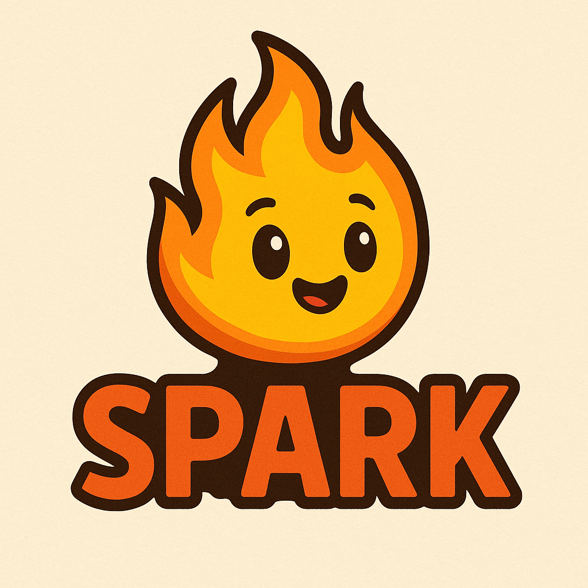
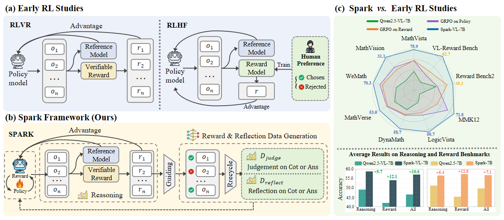
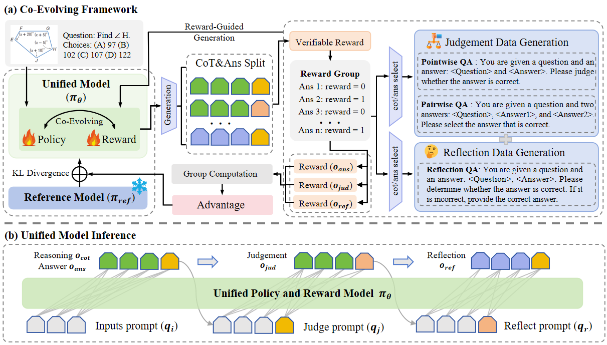

<p align="center">
  <h1 align="center"></h1>
  <h1 align="center">Spark: Synergistic Policy And Reward Co-Evolving Framework</h1>
    <p align="center">
    <a href="https://github.com/Liuziyu77"><strong>Ziyu Liu</strong></a>
    ·
    <a href="https://yuhangzang.github.io/"><strong>Yuhang Zang</strong></a>
    ·
    <a href="https://scholar.google.com/citations?user=iDPJVBsAAAAJ&hl=zh-CN"><strong>Shengyuan Ding</strong></a>
    ·
    <a href="https://scholar.google.com/citations?user=sJkqsqkAAAAJ"><strong>Yuhang Cao</strong></a>
    ·
    <a href="https://lightdxy.github.io/"><strong>Xiaoyi Dong</strong></a>
    ·
    <a href="https://kennymckormick.github.io/"><strong>Haodong Duan</strong></a>
    ·
     <a href="http://dahua.site/"><strong>Dahua Lin</strong></a>
    ·
     <a href="https://myownskyw7.github.io/"><strong>Jiaqi Wang</strong></a>
  </p>
  <!-- <h2 align="center">Accepted By ICCV 2025!</h2> -->
<!-- 🏠<a href="https://liuziyu77.github.io/MIA-DPO/">Homepage</a></h3>| -->
  📖<a href="https://arxiv.org/abs/2509.22624">Paper</a> |
  🤗<a href="https://huggingface.co/internlm/Spark-VL-7B">Models</a> | 🤗<a href="https://huggingface.co/datasets/internlm/Spark-Data">Datasets</a></h3> | 🤗<a href="https://arxiv.org/abs/2509.22624">Daily Paper</a></h3>
<div align="center"></div>
<p align="center">
  <p>
🌈<strong>Introduction: </strong>
We propose SPARK, <strong>a unified framework that integrates policy and reward into a single model for joint and synchronous training</strong>. SPARK can automatically derive reward and reflection data from verifiable reward, enabling <strong>self-learning and self-evolution</strong>. Furthermore, we instantiate this framework on multiple backbones, training <strong>SPARK-VL-7B</strong>, <strong>SPARK-7B</strong>, and <strong>SPARK-VL-32B</strong>.

⭐ If you find our code or model helpful, please consider giving us a star — your support means a lot!
  </p>
<!--     <a href="">
       
    </a> -->
<br>

## 📢 News
- 🚀 [09/29/2025] We release our 🤗<a href="https://huggingface.co/datasets/internlm/Spark-Data">datasets</a>.
- 🚀 [09/29/2025] We release our **Spark's** <a href="https://arxiv.org/abs/2509.22624">Paper</a>.
- 🚀 [09/29/2025] We upload our evaluation code and model checkpoints.
- 🚀 [09/29/2025] We release **Spark** repository.

## 💡 Highlights
- 🔥 **Synergistic Policy–Reward Co-Evolving (SPARK)**: We introduce SPARK, a unified reinforcement fine-tuning framework that jointly optimizes policy and reward within a single model through on-policy co-evolution..
- 🔥 **Recycling Rollouts**: Unlike conventional RL pipelines that discard rollouts after policy updates, SPARK recycles RLVR rollouts into pointwise, pairwise, and reflection objectives, enabling the model itself to act as both a strong policy and a generative reward model.
- 🔥 **Co-Evolving Mechanism**: Improved reward accuracy provides better gradients for policy learning, while stronger reasoning further refines reward judgment, forming a positive feedback loop that enhances reasoning, judgment, and reflection in synergy.
- 🔥 **Efficient and Practical**: SPARK requires no human preference data, teacher models, or external reward models, making it significantly more data- and compute-efficient than traditional RM-based RL pipelines.


<a href="">
  
</a>


## ⚙️ Framework
**SPARK** introduces a unified reinforcement learning framework where policy and reward evolve within a single model.
Traditional RL pipelines either rely on external reward models (**RLHF**) or discard verifiable rewards (**RLVR**). In contrast, SPARK recycles verifiable rewards to guide on-policy reward and reflection data generation:

This design turns the model into **both a strong policy and a generative reward model**. Through on-policy co-evolving, SPARK establishes a positive feedback loop: **improved reward accuracy provides stronger policy gradients, while better reasoning further enhances reward judgment**.

As a result, SPARK not only boosts reasoning and judgment simultaneously but also unlocks self-reflection ability at test time, enabling more stable and generalizable performance across diverse tasks.

<a href="">
  
</a>

## 🛠️ Setup
```
git clone https://github.com/InternLM/Spark.git
conda create -n Lmm_xc python=3.10
conda activate Visual-RFT
cd /Spark/Lmm_XC
pip install -e .[vllm]
pip install flash_attn --no-build-isolation
```
Lmm_XC is developed upon modifications to the LMM-R1 project, and its installation process can be referred to the LMM-R1 instructions.

## Datasets
🔦 Our dataset includes the training data for **Spark-VL-7B** and **Spark-VL-32B** models, as well as a collection of all **multimodal mathematical benchmarks**. It can be directly downloaded and used. Refer to 🤗<a href="https://huggingface.co/datasets/internlm/Spark-Data">datasets</a>.

## Inference
We have uploaded the model <strong>Spark-VL-7B</strong> (<a href="https://huggingface.co/internlm/Spark-VL-7B">🤗Huggingface</a>). You can use it to evaluate the inference performance of on Multimodal Mathematical Benchmarks and Reward-Related Benchmarks. 
It should be noted that during our training process, we append the following prompt at the end of the input to facilitate answer extraction. Therefore, it is recommended to also append this prompt at the end during testing.
```
 Please first conduct reasoning, and then answer the question. Repeat the final answer using a '\\boxed{}'.
```

#### 🤗 Using Transformers

Our model is based on Qwen2.5-VL-7B-Instruct. You can use the same code as the Qwen2.5-VL-7B-Instruct model for inference, referring to <a href="https://huggingface.co/Qwen/Qwen2.5-VL-7B-Instruct">🤗Huggingface</a>.
```python
from transformers import Qwen2_5_VLForConditionalGeneration, AutoTokenizer, AutoProcessor
from qwen_vl_utils import process_vision_info

model = Qwen2_5_VLForConditionalGeneration.from_pretrained(
    "internlm/Spark-VL-7B",
    torch_dtype=torch.bfloat16,
    attn_implementation="flash_attention_2",
    device_map="auto",
)

processor = AutoProcessor.from_pretrained("internlm/Spark-VL-7B")

messages = [
    {
        "role": "user",
        "content": [
            {
                "type": "image",
                "image": image_path,
            },
            {"type": "text", "text": prompt},
        ],
    }
]

# Preparation for inference
text = processor.apply_chat_template(
    messages, tokenize=False, add_generation_prompt=True
)
image_inputs, video_inputs = process_vision_info(messages)
inputs = processor(
    text=[text],
    images=image_inputs,
    videos=video_inputs,
    padding=True,
    return_tensors="pt",
)
inputs = inputs.to("cuda")

# Inference: Generation of the output
generated_ids = model.generate(**inputs, max_new_tokens=128)
generated_ids_trimmed = [
    out_ids[len(in_ids) :] for in_ids, out_ids in zip(inputs.input_ids, generated_ids)
]
output_text = processor.batch_decode(
    generated_ids_trimmed, skip_special_tokens=True, clean_up_tokenization_spaces=False
)
print(output_text)
```

#### 🔦 Using vLLM

We recommend using **vLLM** for faster inference speed. Using vLLM leads to significant speed improvements in dataset evaluation.
```bash
PORT=8019
N_PROC=256
SERVE_NAME=spark_vl_7b
MODEL_PATH=/internlm/Spark-VL-7B

CUDA_VISIBLE_DEVICES=0,1,2,3 vllm serve "$MODEL_PATH" \
  --tensor-parallel-size 4 \
  --served-model-name $SERVE_NAME \
  --port $PORT \
  --max-num-seqs $N_PROC
```


## Training

### Spark Training 
After downloading the dataset, you can start training using the following example bash script. Our bash scripts are in ```/Spark/Lmm_XC/XC/scripts/spark_training```
You need to modify the dataset paths and model paths to your own locations.
```
export WORKSPACE_DIR="/fs-computility/....../Lmm_XC"                 # Path to project root directory
export DATASET_PATH="/fs-computility/....../infer_data_ViRL_19k.json"            # Path to your dataset
export PRETRAIN_MODEL_PATH="/fs-computility/....../Qwen2.5-VL-7B-Instruct"  # Path to pretrained model
export WANDB_PROJECT="Observation"        # Name for this project
export MODEL_CPK_NAME="Qwen2.5-VL-7B-GRPO-virl-19k-iar-reflection-hyb-diverse-bs64-e2"         # Name for this training run
export LOG_PATH='/fs-computility/....../Qwen2.5-VL-7B-GRPO-virl-19k-iar-reflection-hyb-diverse-bs64-e2.txt'      #Log file save path


export WANDB_API_KEY="......"
export SAVE_PATH="/fs-computility/....../${WANDB_PROJECT}/${MODEL_CPK_NAME}"                   # Absolute path to save everything about this training run
export CKPT_PATH="${SAVE_PATH}/ckpt"                                                                    # Path to save checkpoints                                    
export FINAL_CKPT_PATH="${SAVE_PATH}/final_ckpt"                                                        # Path to save final checkpoints
export TIMESTAMP=$(date +%Y%m%d_%H%M%S)                                                                 # Timestamp
export CUR_LOG_DIR="${SAVE_PATH}/training_logs/${TIMESTAMP}"                                            # Path to save current run logs
export LOG_DIR="${SAVE_PATH}/tb_logs"  
```
⏰ Attention:
```
export DEV_MODE=0 # Set to 1 for debug mode on single dev machine
```

## Evaluation
The integrated multimodal mathematics dataset can be downloaded from 🤗<a href="https://huggingface.co/datasets/internlm/Spark-Data">datasets</a> and evaluated using the scripts provided in the `Evaluation` folder. The evaluation results will be stored, and accuracy can subsequently be computed with the `calculate_acc.py` file.
```
bash ./Evaluation/eval_spark_vl_7b.sh
python calculate_acc.py --result_path ./your_result_path.json
```

## ✒️Citation
```
TBD
```

## 📄 License
  **Usage and License Notices**: The data and code are intended and licensed for research use only.
License: Attribution-NonCommercial 4.0 International It should abide by the policy of OpenAI: https://openai.com/policies/terms-of-use

## Acknowledgement
We sincerely thank projects <a href="https://github.com/TideDra/lmm-r1">lmm-r1</a> and <a href="https://github.com/OpenRLHF/OpenRLHF">OpenRLHF</a> for providing their open-source resources.


